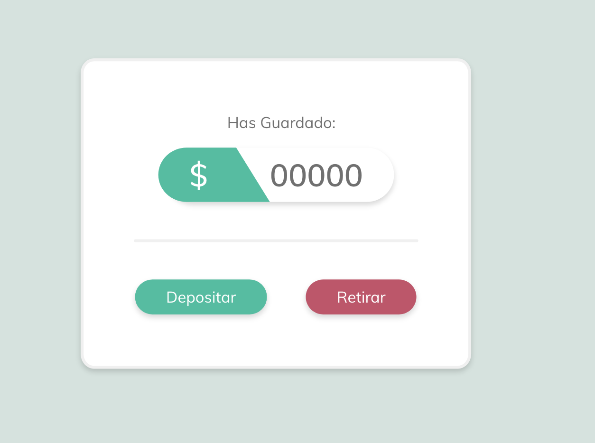
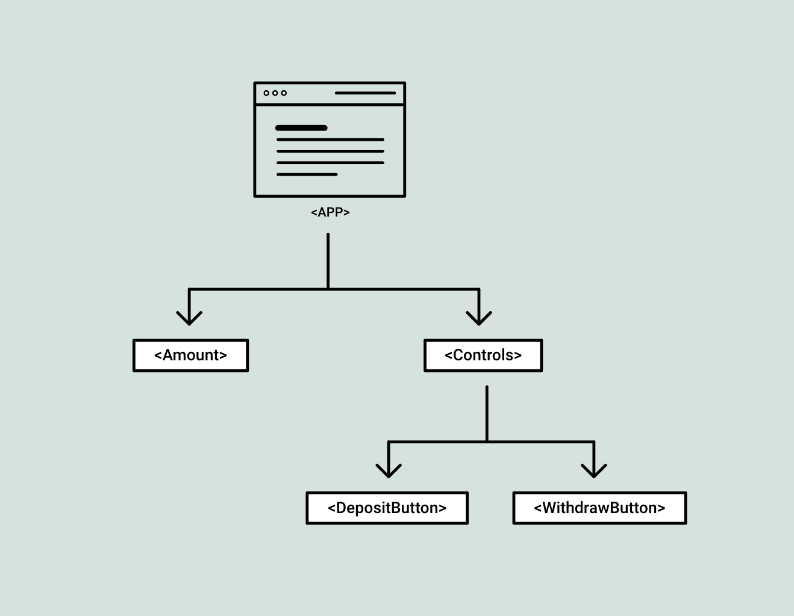

# React context ⚛️

Desarrollo de un proyecto de 10\$ al dia para hacer un seguimiento de tus ahorros



## Motivacion 💪

Probar la utilidad de context de react para implementarlo en una app.

## Inspiracion 💡

Esta practica esta inspirada en un articulo muy interesante de @Brslv

[Articulo Completo](https://medium.com/swlh/this-is-how-to-use-the-react-context-api-with-hooks-for-a-clean-code-architecture-2019-e66662ec7ab8)

## Autores ✒️

Juan Lopez - Trabajo Inicial -

## Paso a Paso 📋

### Crear La interface

#### Extructura de la app

Nuestro applicacion tendra un componete `<App>`, dentro de el tendra dos componentes uno de `<Amount>` 'Cantidad' y `<Controls>` 'Contenedor de los botones'. Dentro de <Controls> tendremos otros dos compontes que seran los botones `<DepositButton>` 'Boton de deposito de 10$' y ```<WithdrawButton>``` 'Boton de retirada de 10$'

Estructura:



##### Componente App

Donde se montaran todos los compontes de la app

//img

##### Componente Amout

Mustra la cantidad actual de tus ahorros

//img

##### Componente Controls

El contenedor de los dos botones

//img

##### Componente Button

Segun el typo que se le manda se usa para los dos botones el de depositar y el de retirar

//img

#### Context

crearemos un componte Context que contrndra el estado y la logica de nuestar app para poder usarlo en donde deseemos

// img

#### Usar el contexto en la app

empezamos a usar el context en la app

## // img

##### DISEÑO

https://xd.adobe.com/view/e88d6fd2-e520-4570-49be-92de8dec0485-9ebc/

#### HOJAS DE TURCOS

https://devhints.io/enzyme
